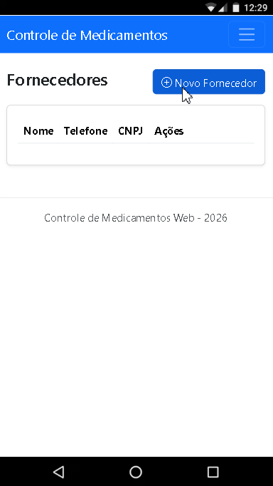

# 💊 Controle de Medicamentos Web




Sistema de Controle de Medicamentos desenvolvido em ASP.NET Core MVC utilizando persistência em arquivos JSON, arquitetura modular e boas práticas de desenvolvimento orientado a objetos.

---

# 📋 Sobre o Projeto

O Controle de Medicamentos Web é uma aplicação destinada ao gerenciamento de medicamentos, pacientes, fornecedores, funcionários e movimentações de estoque de uma unidade de saúde, clínica ou farmácia.

O sistema permite controlar a entrada e saída de medicamentos, garantindo que o estoque seja atualizado automaticamente e impedindo retiradas superiores à quantidade disponível.

---

# 🚀 Tecnologias Utilizadas

* ASP.NET Core MVC
* C#
* .NET 8
* Razor Pages
* Bootstrap 5
* AutoMapper
* FluentResults
* System.Text.Json
* Injeção de Dependência (Dependency Injection)

---

# 🏗️ Arquitetura do Projeto

O projeto segue uma arquitetura modular dividida em:

```text
ControleMedicamentosWeb
│
├── Compartilhado
│
├── ModuloFornecedor
│
├── ModuloPaciente
│
├── ModuloMedicamento
│
├── ModuloFuncionario
│
├── ModuloEstoque
│   ├── ModuloRequisicaoEntrada
│   └── ModuloRequisicaoSaida
│
└── WebApp
```

Cada módulo possui:

```text
Dominio
Aplicacao
Infraestrutura
Apresentacao
```

---

# 📂 Estrutura das Camadas

## Domínio

Responsável pelas entidades e contratos de repositório.

Exemplos:

* Fornecedor
* Paciente
* Medicamento
* Funcionário
* Requisição de Entrada
* Requisição de Saída

---

## Aplicação

Responsável pelas regras de negócio.

Exemplos:

* Serviços
* DTOs
* Validações

---

## Infraestrutura

Responsável pela persistência dos dados.

Exemplos:

* Repositórios
* ContextoJson
* DadosAplicacao

---

## Apresentação

Responsável pela interface do usuário.

Exemplos:

* Controllers
* ViewModels
* Views
* AutoMapper Profiles

---

# 💾 Persistência de Dados

O sistema utiliza persistência em arquivo JSON.

Arquivo:

```text
dados.json
```

Estrutura:

```json
{
  "fornecedores": [],
  "pacientes": [],
  "medicamentos": [],
  "funcionarios": [],
  "requisicoesEntrada": [],
  "requisicoesSaida": []
}
```

---

# 🏢 Módulo de Fornecedores

## Funcionalidades

* Cadastrar fornecedor
* Editar fornecedor
* Excluir fornecedor
* Visualizar fornecedores

## Campos

* Nome
* Telefone
* CNPJ

## Regras de Negócio

* Nome obrigatório (3 a 100 caracteres)
* Telefone obrigatório
* CNPJ obrigatório
* Não permitir CNPJ duplicado

---

# 🧑‍⚕️ Módulo de Pacientes

## Funcionalidades

* Cadastrar paciente
* Editar paciente
* Excluir paciente
* Visualizar pacientes

## Campos

* Nome
* Telefone
* Cartão SUS
* CPF

## Regras de Negócio

* Nome obrigatório
* CPF obrigatório
* Cartão SUS obrigatório
* Não permitir cartão SUS duplicado

---

# 💊 Módulo de Medicamentos

## Funcionalidades

* Cadastrar medicamento
* Editar medicamento
* Excluir medicamento
* Visualizar medicamentos

## Campos

* Nome
* Descrição
* Quantidade em Estoque
* Fornecedor

## Regras de Negócio

* Nome obrigatório
* Descrição obrigatória
* Quantidade maior que zero
* Fornecedor obrigatório

## Destaque de Estoque

Medicamentos com menos de 20 unidades são considerados:

```text
EM FALTA
```

---

# 👨‍💼 Módulo de Funcionários

## Funcionalidades

* Cadastrar funcionário
* Editar funcionário
* Excluir funcionário
* Visualizar funcionários

## Campos

* Nome
* Telefone
* CPF

## Regras de Negócio

* Nome obrigatório
* CPF obrigatório
* Não permitir CPF duplicado

---

# 📦 Controle de Estoque

O estoque é atualizado automaticamente através das movimentações de entrada e saída.

---

# 📥 Requisições de Entrada

## Funcionalidades

* Registrar entrada de medicamentos
* Visualizar entradas realizadas

## Campos

* Data
* Medicamento
* Funcionário
* Quantidade

## Regras de Negócio

* Data obrigatória
* Medicamento obrigatório
* Funcionário obrigatório
* Quantidade maior que zero

## Atualização do Estoque

Ao registrar uma entrada:

```text
Novo Estoque = Estoque Atual + Quantidade
```

Exemplo:

```text
Estoque Atual: 50

Entrada: 10

Novo Estoque: 60
```

---

# 📤 Requisições de Saída

## Funcionalidades

* Registrar saída de medicamentos
* Visualizar saídas realizadas

## Campos

* Data
* Paciente
* Medicamento
* Quantidade

## Regras de Negócio

* Data obrigatória
* Paciente obrigatório
* Medicamento obrigatório
* Quantidade maior que zero

---

## Controle de Estoque

Ao registrar uma saída:

```text
Novo Estoque = Estoque Atual - Quantidade
```

Exemplo:

```text
Estoque Atual: 40

Saída: 5

Novo Estoque: 35
```

---

## Validação de Estoque

O sistema impede retiradas maiores que o estoque disponível.

Exemplo:

```text
Estoque Atual: 10

Solicitação: 15

Resultado:
Estoque insuficiente para atender a requisição.
```

---

# 🔄 AutoMapper

O projeto utiliza AutoMapper para realizar conversões entre:

```text
ViewModel → DTO

DTO → Entidade

DTO → ViewModel
```

---

# ⚠️ FluentResults

O projeto utiliza FluentResults para tratamento de validações e erros.

Exemplo:

```csharp
return Result.Fail(
    "Estoque insuficiente para atender a requisição.");
```

---

# 🎨 Interface

A interface foi desenvolvida utilizando:

* Bootstrap 5
* Razor Views
* Layout compartilhado
* Navegação por módulos

---

# 📌 Funcionalidades Implementadas

## Fornecedores

* Cadastro
* Edição
* Exclusão
* Listagem

## Pacientes

* Cadastro
* Edição
* Exclusão
* Listagem

## Medicamentos

* Cadastro
* Edição
* Exclusão
* Listagem

## Funcionários

* Cadastro
* Edição
* Exclusão
* Listagem

## Requisições de Entrada

* Cadastro
* Listagem
* Atualização de estoque

## Requisições de Saída

* Cadastro
* Listagem
* Controle de estoque
* Bloqueio de estoque insuficiente

---

# ▶️ Como Executar

1. Clone o repositório

```bash
git clone URL_DO_REPOSITORIO
```

2. Abra a solução no Visual Studio

3. Restaure os pacotes NuGet

4. Execute o projeto

```bash
Ctrl + F5
```

ou

```bash
F5
```

---

# 📚 Conceitos Aplicados

* Programação Orientada a Objetos
* MVC (Model-View-Controller)
* Repository Pattern
* Injeção de Dependência
* AutoMapper
* FluentResults
* Persistência JSON
* Arquitetura em Camadas
* Modularização de Sistemas

---

# 👨‍💻 Autor

Projeto desenvolvido por Thiago Silva durante os estudos de Análise e Desenvolvimento de Sistemas e Formação Full Stack da Academia do Programador.
